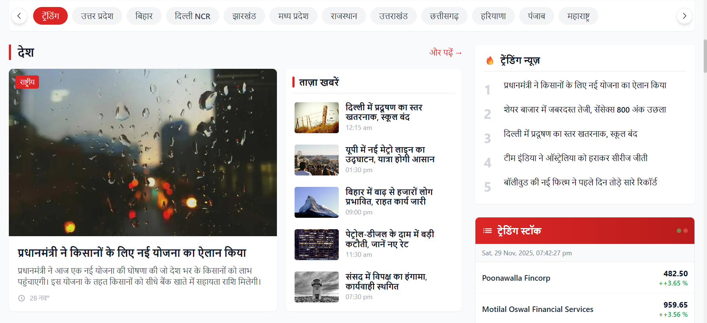
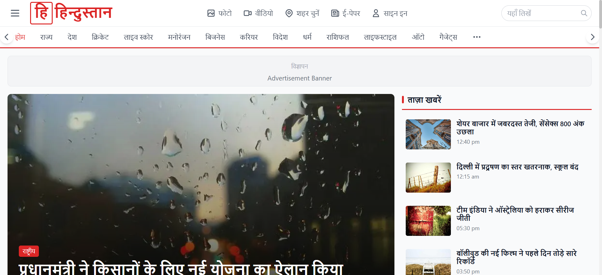
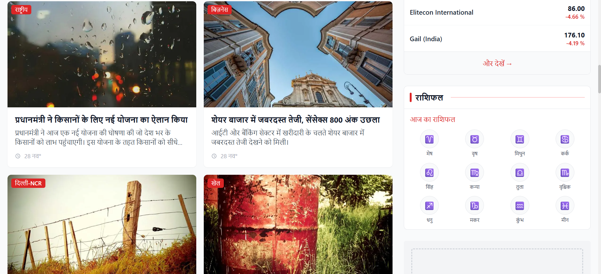
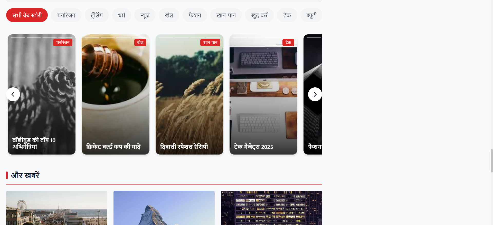

# LiveHindustan Clone - Complete Project Documentation

## Table of Contents

1. [Part A - Design Document](#part-a---design-document)
2. [Part B - Code Explanation](#part-b---code-explanation)
3. [Part C - Testing & Edge Cases](#part-c---testing--edge-cases)
4. [Part D - AI Use & Reflection](#part-d---ai-use--reflection)

---

# Part A - Design Document

## 1. Screenshots - Actual Implementation

Below are screenshots from different views of the implemented LiveHindustan clone:

| Screenshot                                        | Description                                                     |
| ------------------------------------------------- | --------------------------------------------------------------- |
|           | **Full Page Layout** - Header, hero, category sections, sidebar |
|            | **Hero Section** - Featured story with side stories list        |
|  | **Breaking News** - Horizontal scrolling news ticker            |
|          | **More News** - Grid layout for additional articles             |

## 2. Layout Structure

```
┌─────────────────────────────────────────────────────┐
│  HEADER: Logo + Nav + Search                        │
├─────────────────────────────────────────────────────┤
│  HERO: Main Story (2/3) │ Side Stories (1/3)        │
├─────────────────────────────────────────────────────┤
│  FILTER CHIPS: Scrollable category tags             │
├────────────────────────────────┬────────────────────┤
│  MAIN CONTENT (2/3)            │  SIDEBAR (1/3)     │
│  - Category Sections           │  - Trending News   │
│  - Horoscope                   │  - Stock Widget    │
│  - Web Stories                 │  - Horoscope Mini  │
├────────────────────────────────┴────────────────────┤
│  FOOTER                                             │
└─────────────────────────────────────────────────────┘
```

## 3. Layout Decisions

| Element          | Desktop         | Tablet | Mobile  |
| ---------------- | --------------- | ------ | ------- |
| Main Content     | 2/3 width       | Full   | Full    |
| Sidebar          | 1/3 width       | Full   | Full    |
| Category Section | 3:2 (main:side) | 1:1    | Stacked |

**Why This Layout?**

- **2/3 + 1/3 Split**: F-pattern reading, visual priority for main content
- **Category Section**: 1 main card + 5 side cards + 2 bottom cards
- **Mobile-First**: Stacked layout on mobile, grid on desktop

---

## 4. Data-Fetching Strategy

### Chosen Method: Static Site Generation (SSG) with `generateStaticParams`

| Method                 | Pros               | Cons                | Our Choice    |
| ---------------------- | ------------------ | ------------------- | ------------- |
| `getStaticProps`       | Fast, SEO-friendly | Pages Router only   | ❌            |
| `getServerSideProps`   | Fresh data         | Slower, server load | ❌            |
| `generateStaticParams` | Fast, App Router   | Rebuild for updates | ✅ **CHOSEN** |
| ISR                    | Best of both       | Complex setup       | ⚡ Future     |

### Why SSG?

```javascript
// app/article/[id]/page.js
export async function generateStaticParams() {
  return articles.map((a) => ({ id: a.id }));
}
```

**Justification:**

1. **Performance**: Pre-built HTML → fastest load times
2. **SEO**: Search engines get fully rendered content
3. **Cost**: No server computation per request
4. **News Fit**: Articles don't change after publishing

**Trade-offs:**

- ✅ Lightning fast, CDN cacheable, perfect SEO
- ⚠️ Requires rebuild for new articles

---

# Part B - Code Explanation

## 1. Dynamic Routing

### Article Pages: `/article/[id]`

```javascript
// app/article/[id]/page.js

// Pre-generate all article pages at build
export async function generateStaticParams() {
  return articles.map((a) => ({ id: a.id }));
}

// Dynamic metadata for SEO
export async function generateMetadata({ params }) {
  const article = articles.find((a) => a.id === params.id);
  return {
    title: `${article.title} | हिंदुस्तान`,
    description: article?.summary,
  };
}

// Page component
export default function ArticlePage({ params }) {
  const article = articles.find((a) => a.id === params.id);
  if (!article) return <NotFound />;
  return <ArticleContent article={article} />;
}
```

## 2. Image Optimization

```javascript
// next.config.js
images: {
  domains: ["picsum.photos"];
}

// Usage with Next.js Image
import Image from "next/image";
<Image
  src={article.image || "/placeholder.svg"}
  alt={article.title}
  fill
  priority // For above-fold images
  className="object-cover"
/>;
```

**Benefits:** Lazy loading, responsive sizes, WebP conversion, 30-50% smaller files

## 3. TailwindCSS Styling

```javascript
// Responsive grid
<div className="grid grid-cols-1 md:grid-cols-2 lg:grid-cols-3 gap-4">

// Hover effects
<Image className="group-hover:scale-105 transition duration-300" />

// Text truncation
<h3 className="line-clamp-2">Long title...</h3>

// Custom scrollbar hide
.scrollbar-hide::-webkit-scrollbar { display: none; }
```

**Color Scheme:** Primary Red `#dc2626`, Gray backgrounds, White cards

## 4. SEO Implementation

```javascript
// app/layout.js - Global metadata
export const metadata = {
  title: "हिंदुस्तान - Hindi News",
  description: "हिंदी न्यूज़, ताज़ा खबर...",
};

// JSON-LD Schema
const jsonLd = {
  "@context": "https://schema.org",
  "@type": "NewsArticle",
  headline: article.title,
  datePublished: article.publishedAt,
};
```

## 5. Component Architecture

| Component            | Purpose                              |
| -------------------- | ------------------------------------ |
| `Nav.js`             | Header with logo, categories, search |
| `Hero.js`            | Featured story + side stories        |
| `Card.js`            | Article card (3 variants)            |
| `CategorySection.js` | Main + side + bottom layout          |
| `Sidebar.js`         | Trending, stocks, horoscope          |
| `SkeletonCard.js`    | Loading placeholder                  |

## 6. Data Model

```typescript
interface Article {
  id: string;
  title: string; // Hindi headline
  summary: string; // 2-3 lines
  image: string; // URL or null
  publishedAt: string; // ISO 8601
  content: string; // Full body
  source: string; // राष्ट्रीय, खेल, etc.
  category: string; // देश, मनोरंजन, खेल
}
```

## 7. Challenges & Solutions

| Challenge                    | Solution                               |
| ---------------------------- | -------------------------------------- |
| Pages vs App Router conflict | Removed `pages/`, used App Router only |
| Image domain blocked         | Added to `next.config.js` domains      |
| Hindi date formatting        | `toLocaleDateString("hi-IN")`          |
| Scrollbar visible            | Custom `.scrollbar-hide` utility       |
| Uneven side articles         | `flex flex-col justify-between`        |

## 8. Future Improvements

1. Real-time updates with WebSocket
2. Full-text search
3. Dark mode
4. PWA support
5. Infinite scroll

---

# Part C - Testing & Edge Cases

## 1. Edge Cases Handled

| Case               | Implementation                          |
| ------------------ | --------------------------------------- |
| **No image**       | `article.image \|\| "/placeholder.svg"` |
| **Empty articles** | Show "कोई खबर उपलब्ध नहीं है"           |
| **Long titles**    | `line-clamp-2` with ellipsis            |
| **Loading state**  | Skeleton cards with `animate-pulse`     |
| **API error**      | Error message + retry button            |
| **Invalid date**   | Fallback to "अभी"                       |

## 2. Test Example

```javascript
// __tests__/ClientArticles.test.js
test("shows skeletons while loading", async () => {
  global.fetch.mockResolvedValueOnce({
    json: async () => [{ id: "1", title: "Test", image: null }],
  });

  render(<ClientArticles />);
  expect(document.querySelectorAll(".animate-pulse").length).toBeGreaterThan(0);

  await waitFor(() => expect(screen.getByText("Test")).toBeInTheDocument());
});
```

## 3. Run Tests

```bash
npm test                    # Run all
npm test -- --coverage      # With coverage
```

---

# Part D - AI Use & Reflection

## 1. AI-Assisted Parts

| Area                  | AI Contribution                |
| --------------------- | ------------------------------ |
| Component boilerplate | Initial structure, imports     |
| Tailwind classes      | Complex responsive patterns    |
| Data fetching         | useEffect patterns, API routes |
| Mock data             | Hindi article content          |
| Jest setup            | Test configuration             |

## 2. AI Mistakes & Corrections

| AI Suggested             | Problem           | My Fix               |
| ------------------------ | ----------------- | -------------------- |
| Both `pages/` and `app/` | Route conflict    | App Router only      |
| `` tag              | No optimization   | `next/image`         |
| Wrong import paths       | Resolution failed | Fixed relative paths |
| No "use client"          | useState failed   | Added directive      |

## 3. Custom Work Beyond AI

- LiveHindustan exact styling (red #dc2626, bordered logo)
- `justify-between` for even spacing
- Hindi localization (`hi-IN` locale)
- JSON-LD structured data
- Edge case handling

## 4. Verification Process

1. `npm run dev` after each change
2. Read error messages carefully
3. Check Next.js 13 documentation
4. Compare with LiveHindustan screenshots
5. Browser devtools inspection

---

## Summary

| Metric      | Value        |
| ----------- | ------------ |
| Components  | 14           |
| Articles    | 20           |
| Test Files  | 1            |
| AI-Assisted | ~60% initial |
| Manual Work | ~40% final   |

---

_Documentation: November 29, 2025 | LiveHindustan Clone - Next.js_
